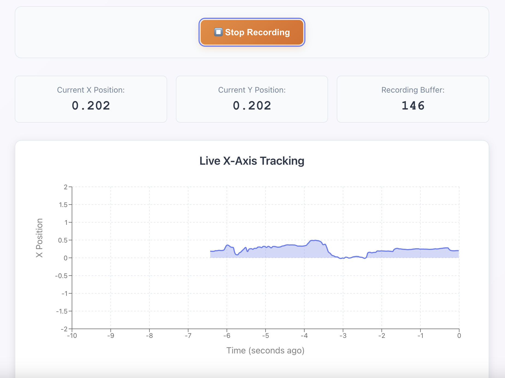
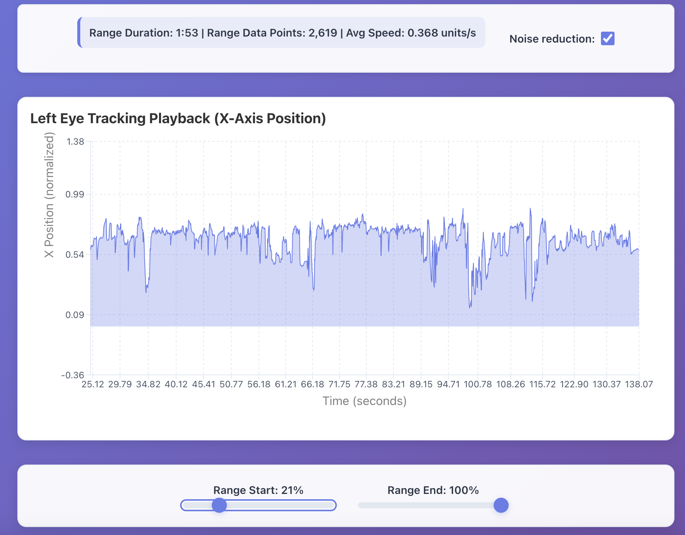

# Aeon lab demo task: eye-motion recorder

This is a small demo app that allows recording eye motions and explore the recordings later. It supports recording and playback.

> **_NOTE:_**  Eye motion is measured as the position of the center of the iris relative the left corner of the eye.  *Normalized* eye motion means the position of the iris in the range [-1;1], where -1 is the left-most the center of the iris can go, and 1 the right-most. The gaze of the user might go out of the screen.

## Features

### Recording tab

The recording tab is a 3 step loop. Every time the loop is restarted, a new recording session is created

#### 1. Camera setup

The user is prompted to give access to the camera. We request a fixed FPS of 30. If the device does not support it the application will display an error. 

#### 2. Calibration

The tracker is calibrated for the user's maximum eye motion. It is not calibrated relative to the screen, but instead to how far left/right the user's iris can move. The user is prompted to look as far left, center and right as they can, pressing `<SPACEBAR>` at each step.

#### 3. Recording

This screen allows to take multiple recordings of the user's eye motion. When clicking the recording button, you will get live feedback on the normalized eye position of the user's left eye over time. When the recording is stopped is gets saved. It's possible to then start a new recording or quit.



### Playback tab

The playback tab let's you explore past recordings. It is only currently possible to visualize the normalized position of the left eye.  

Once you have chosen a recording to explore, it is possible to zoom in or out using the sliders at the bottom of the screen, and to visulasize a moving-averaged denoised signal by ticking the box.

Some statistics are available for the selected data range above the graph.



## Local setup

To start the app locally, start the backend by following the [backend instructions](./backend/README.md), then the frontend by following the [frontend instructions](./camera-app/README.md)

## How is it built?

### Frontend

The frontend is located in `./camera-app`. It's a react/redux app. 

#### MediaPipe Face Landmarker

The iris and eye corners detection happens in real time in the frontend from the user's camera stream, using [MediaPipe Face Landmarker](https://ai.google.dev/edge/mediapipe/solutions/vision/face_landmarker). 
It offers:
- the flexibility of detecting all face landmarks, not only eye related ones (which will be useful to make sure the user did not turn their head out of reasonable bounds, or blinked).
- is resilient to face and eyes disapearing of the frame (either by reporting no face detected, or giving a best effort estimate if eyes are shut).

#### Data recorded

While the frontend only let's you visualize the normalized position of the left eye, we record the following data structure at the three calibration point, and every timepoints of a recording. The more data recorded, the better.

```json
{
  "timestamp": 1703123456789,
  "gaze_direction": "left", // Only for calibration
  "leftEye": {
    "corners": [
      {
        "x": 0.123,
        "y": 0.456,
        "z": 0.123
      },
      {
        "x": 0.234,
        "y": 0.456,
        "z": 0.123
      }
    ],
    "center": {
      "x": 0.178,
      "y": 0.456,
      "z": 0.123
    }
  },
  "rightEye": {
    "corners": [
      {
        "x": 0.456,
        "y": 0.456,
        "z": 0.123
      },
      {
        "x": 0.567,
        "y": 0.456,
        "z": 0.123
      }
    ],
    "center": {
      "x": 0.512,
      "y": 0.456,
      "z": 0.123
    }
  }
}
```

The calibration data is sent to the backend at the end of the calibration steps, and the recording data at the end of the recording.

#### Playback

In the playback tab, we make API calls:
- to retrieve all sessions and recordings ids and metadata
- when the user picks a recording, we query the backend to get the one time series they want to visualise (normalized left eye time series, with or without noise-reduction).

The data processing (normalization and noise-reduction) is light enough that we could have retrieved all the data and do the processing (noise reduction and normalization) in the frontend to save API calls. However in the future heavier processing will happen in the backend, so this is a better reflection of the future architecture.  

## Backend

The backend is located in `./backend`. It is a python FastAPI application.

It offers APIs to:
- save calibration data
- retrieve calibration data: three eye positions and a session id
- save a recording: a bunch of eye positions at a bunch of timestamps, with a session id and a recording number
- retrieve a timeseries for a recording (the normalized position of the left iris, with optional denoizing)

Check out the [API docs!](https://eye-tracking-backend.onrender.com/docs#/)

### Database

We use `PostgresQL` as a database. It has the advantage to be widely available, well documented, and supported by `SQLAlchemy`. While it is not designed for time-series first, it supports large scale time series with no trouble (see this [AWS article](https://aws.amazon.com/blogs/database/designing-high-performance-time-series-data-tables-on-amazon-rds-for-postgresql/)).

In particular, the application is deployed with [Render](https://render.com/) as the time constraints to setup deployment were tight (~30 minutes budget) and it is the fastest platform to deploy on. It only offer PostgresQL or Redis persistence.

#### Schema

For simplicity, we only have 2 tables: one for the calibration data, and one for the recording data. You might think it odd that there is no `Session` or `Recording` table - it makes the code simpler and faster to write to have only a recording data table. It comes at no performance cost. We have an index on `session_id` and `recording_number`, so listing all sessions and recordings will be covered by the index.

# WIP/Future work

## WIP

- there is a bug where you need to reload the page after a recording session for a new recording session to work correctly
- most of the code was generated by AI, and due to time constraint some was not reviewed. There might be some useless or clucky code.
- the app was only tested on an M1 macbook air. The camera setup might not work on a phone (2 cameras), the live tracking a 30 FPS might be too slow on other platforms. It requires more testing
- no test has been writen yet
- because the MediaPipe library is big, it takes quite a bit of time to load if not cached. Add a loader bar to avoid confusion.

## Future work

- record camera resolution that and ask for the highest resolution/framerate allowing real-time detection. It requires some careful consideration
- record metadata about the device
- record face movement, blinking, closed eyes
- record face out of the screen
- record user switching to another tab 